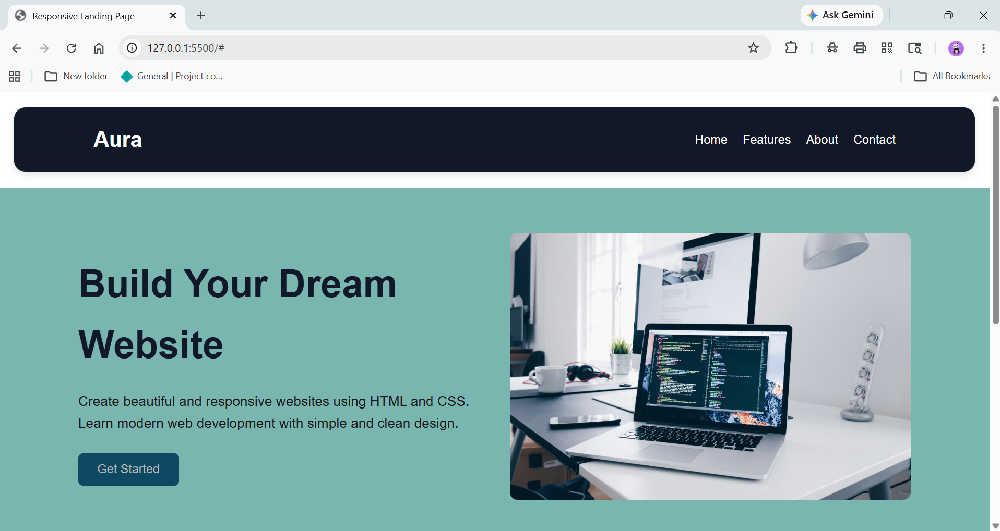
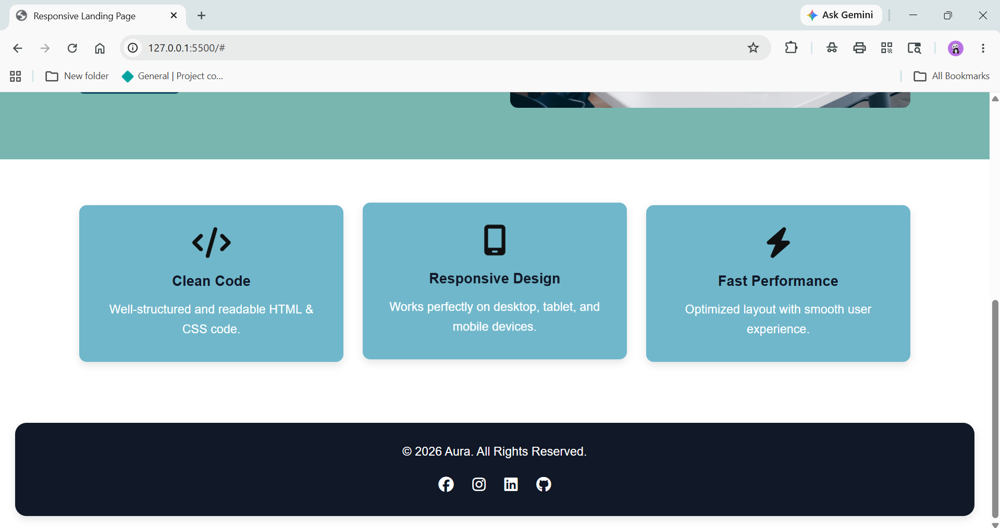

# 🚀 Responsive Landing Page

A modern and responsive landing page built using **HTML5** and **CSS3**. The project focuses on creating a clean user interface, mobile responsiveness, and structured layouts using Flexbox and Grid.

---

## 🌟 Live Preview

A fully responsive landing page that adapts seamlessly across desktop, tablet, and mobile devices.

---

## 📸 Screenshots

### Desktop View



### Responsive Layout



---

## ✨ Features

- 📱 Fully Responsive Design
- 🎨 Modern UI Layout
- 🧭 Navigation Bar
- 🚀 Hero Section
- 📦 Feature Cards Section
- 🔗 Social Media Icons
- 📐 CSS Flexbox & Grid
- 📱 Mobile-Friendly Interface
- ⚡ Lightweight and Fast

---

## 🛠️ Tech Stack

### Frontend
- HTML5
- CSS3

### Icons
- Font Awesome

### Development Tools
- Visual Studio Code
- Live Server
- Google Chrome

---

## 📂 Project Structure

```bash
Responsive-Landing-Page/
│
├── index.html
├── style.css
├── README.md
├── Page.png
└── Page2.png
```

---

## 🎯 Learning Outcomes

This project helped strengthen understanding of:

- Semantic HTML Structure
- CSS Styling Techniques
- Flexbox Layout
- CSS Grid Layout
- Responsive Web Design
- Media Queries
- UI Design Principles

---

## 🚀 Getting Started

### Clone the Repository

```bash
git clone https://github.com/your-username/responsive-landing-page.git
```

### Navigate to the Project

```bash
cd responsive-landing-page
```

### Run the Project

Simply open `index.html` in your browser or use the **Live Server** extension in VS Code.

---

## 💡 Future Improvements

- Dark Mode Support
- Smooth Animations
- Contact Form Integration
- Improved Accessibility
- More Interactive Components

---

## 👩‍💻 Author

**Trupthi Shetty**


